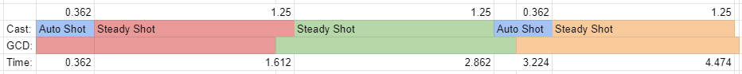

# RIP 3:2, long live 3:2

This is just a repost of an explanation I've given a couple times in the last week.  It explains the following:

- What is GCD desyncing?
- Does GCD desyncing work in classic? _(no)_

- What is 3:2 and why is it special?
- Will I 3:2 in classic TBC? _(no)_

- Is 3:2 possible without GCD desyncing? _(sure, but its useless)_

- Will it work in classic TBC? _(not likely)_
- What rotation(s) will I use in TBC classic?

- Finally, why is Bouk so dooming about this? **(warning, opinions)**.


# Spell Queuing and GCD Desyncing

In classic right now, spells can be queued .5 seconds before a previous action is finished.  As an example, classic hunters (weapon speed permitting) should be queuing their Aimed Shots behind autos to have 0 delay between the casts.

I'm not exaclty sure for which patches GCD desyncing existed, but it certainly existed for some time starting 2.3.* and for all for 2.4.*.  During these patches, when a spell was queued with the technique above--_and the GCD wasn't currently active_--the GCD started when the spell was queued, and not when the spell's cast began.  

```
/cast !Auto Shot
/cast Steady Shot
```

For example, pressing the above macro while your ranged attack is ready would cast an auto at 0s, start the GCD for steady at 0s, and cast your steady immediately following your auto.  With just BM 20% haste and 15% quiver haste\*, your steady begins casting at .362s, finishes at 1.612s, and the GCD from that steady had already finished at 1.5s.

If you had not GCD queued the steady cast, you would be waiting another .362 seconds before you could cast your next steady shot.

\* _we currently do not believe quiver haste effects steady shot.  If it does, nothing major changes about this post except the exact numbers used in this calculation._


# 3:2

3:2 is 3 steady shots to 2 auto shots in this order: `auto - steady - steady - auto - steady.`  It is only ( special / worth talking about / interesting ) when considering GCD desyncing.

3:2 is designed to desync the GCDs of the first 2 steadies to pack their casts into a smaller time window so that you delay your auto by the least amount of time possible.  The single steady at the end is meant to allow your GCD to "catch up" to the next time you begin the rotation.  Here is an example of what that looks like with a weapon speed < 3.  



There will be a small delay waiting for your weapon to be ready to repeat

# 3:2 and you

Without GCD desyncing, 3:2 is simply a 2:1 followed by a 1:1.  And while both of those rotations can benefit from GCD desyncing, 3:2 is fundamentally only useful with GCD desyncing.  If GCD desyncing isn't possible, there is no sense in practicing or performing 3:2, you'll do either 2:1 or 1:1 depending on your weapon speed and haste (or that weird SV shit).

# GCD and TBC

GCD desyncing currently does not work in classic.  When you queue a spell, the GCD for that spell begins when the spell begins casting.  

We're not confident why GCD desyncing worked in TBC, but if I had to hazard a wild guess I'd say it was an inconsistency brought about by some part of GCDs being handled client client sided while casts/actions were being verified more strictly on the server side.  I bring this up to say that I doubt GCD desyncing will be re-implemented for TBC since its such a weird behavior touching both server and client side handling of spell casting which only effects hunters (you need a core rotation of spells with cast times less than the GCD and casts which do not have GCDs to benefit from the tech).

# Bouk's Doom

**Warning: opinions.**

I love classic WoW hunter.  It was the fourth class I played in classic but immediately became my main.  From the weirdness of having such a sparse core rotation to how abusable FD and pet aggro manipulation is--and how much agency our pulling roll in raid affords us--, I've deeply enjoyed playing hunter in classic.

The lack of 3:2 in TBC doesn't kill this class.  I could care less about it lowering our top end damage (which it does-- likely by a lot). I am, however, deeply sad that it abruptly cuts down a large, and fun, and bizare, upper part of the skill ceiling for hunters.

We may have rolling drums and we'll have Misdirects.  We'll be swapping rotations based on haste while `reset=#` remains invalid.  And certainly, for as long as Sixx and Skinnay play, we'll have weaving.

But 3:2 was a constant rhythm game built into the rotation that hunters who had spent a year playing classic, practicing weaves, rolling trinket CDs and FD swaps, and changing our rotations based on haste,-- could look forward to becoming better at.  It could have been a way our rotation changes to something more interesting than `aimed > ms > weave` and avoiding clipping; instead, its absence feels like a slight watering down of an alright rotation.